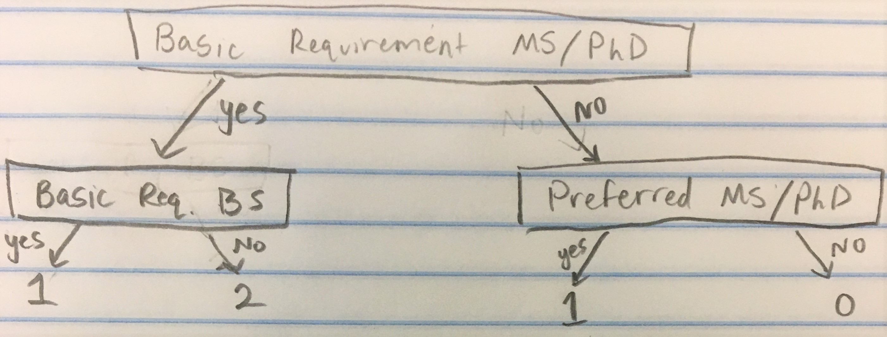

##  Introduction
According to Business Insider, Amazon ranks fifth for companies that computer science students really want to work for after they graduate. Not only this, but they are also gaining plenty of attention over their hq2, Amazon's second headquarters which location will be announced in the very near future. Of the twenty potential locations for hq2, 2 were in Maryland, and another was in Northern Virginia. This close proximity, along with natural prestige, has made  Amazon a very reputable company one that many students, especially those at the University of Maryland, want to work for. Thus, today we will explore Amazon's recent job postings, and see what it is they are looking for in future employees. We will go over how to tidy data, how to analyze data, how to use statistics with data, along with writing code in R and SQL. So, let's get started.

(Optional Read) Business Insider Article "15 places where computer science majors dream of working":
http://www.businessinsider.com/dream-companies-and-organizations-for-computer-science-students-2017-5#6-blizzard-entertainment-10


## Include Libraries

We will be using the following libraries in our data analysis, so it is important that we download them "install.packages(<package_name>)" and then include them here. They do as follows,

tidyverse: Set of packages designed to make it easy to install multiple packages
tidyr: Makes it easy to tidy data
stringr: Contains Convenient Functions on Strings
ggplot2: Used to Create Plots and Graphs
sqldf: Manipulates R Data Frames Using SQL
```{r setup, include=FALSE}

library(tidyverse)
library(tidyr)
library(stringr)
library(ggplot2)
library(sqldf)

```
For more information on any of these libraries, check out the following links:
tidyverse: https://www.tidyverse.org/packages/
tidyr: https://cran.r-project.org/web/packages/tidyr/tidyr.pdf
stringr: ftp://cran.r-project.org/pub/R/web/packages/stringr/stringr.pdf
ggplot2: https://cran.r-project.org/web/packages/ggplot2/ggplot2.pdf
sqldf: https://cran.r-project.org/web/packages/sqldf/sqldf.pdf

## Get the Data
First, download the dataset from https://www.kaggle.com/atahmasb/amazon-job-skills. This will be in a CSV file, called "amazon_jobs_dataset.csv". We get the data by using read_csv. This function will read the csv (Comma Seperated Values) file in our directory, and make a data frame from it. We then change the column names to whatever is appropriate.

```{r}
amazon_df <- read_csv("amazon_jobs_dataset.csv") 

#Changes the column names to be what is in the list
names(amazon_df) <- c("ID", "Position", "Location", "Date", "Description", "Basic_Qual", "Preferred_Qual")


amazon_df <- amazon_df %>% as_data_frame()

#Remove ID, since we will not be using it in our data analysis
amazon_df$ID <- NULL

amazon_df %>% head()
```


## Tidy Data

While we now have our data, it looks like some of the data could be changed to make it more useful. The date is currently a string instead of a date attribute, and the locations would be more valuable to us if they were broken down into Country, State and City. Let's Tidy the data now to make it more useful. 

We will be using regexpr and str_sub here. These are described below

Regular Expressions match string inputs to ensure they are of a certain type. In this scenario, we want inputs that have two commas, indicating that there is a valid state attribute, to have a state attribute. Those that do not should have NA

For more information on regexpr, go to: 
http://rfunction.com/archives/1719

str_sub gets a substring of a string from a given 'start' to a given 'end', including the character at both locations.

For more information on str_sub, go to: 
https://www.rdocumentation.org/packages/stringr/versions/0.6.2/topics/str_sub

```{r}

#Change posting date from a string into a date
amazon_df <- readr::type_convert(amazon_df, col_types = cols( Date = col_datetime(format = "%B %d, %Y"), .default = col_character()))

#Add columns Country, State, and City based on the location attribute
amazon_df$Country <- amazon_df$Location %>% str_sub(start = 1, end = 2)

amazon_df$State <- ifelse(regexpr(", [A-Z]{2},", amazon_df$Location) == -1, NA,  amazon_df$Location %>% str_sub(start = 5, end = 6))

amazon_df$City <- ifelse(regexpr(", [A-Z]{2},", amazon_df$Location) == -1, amazon_df$Location %>% str_sub(start = 5),  amazon_df$Location %>% str_sub(start = 8))

#Tidy Country by changing abbreviations into the full name
amazon_df$Country[amazon_df$Country == "US"] <- "United States"
amazon_df$Country[amazon_df$Country == "IT"] <- "Italy"
amazon_df$Country[amazon_df$Country == "IN"] <- "India"
amazon_df$Country[amazon_df$Country == "CA"] <- "Canada"
amazon_df$Country[amazon_df$Country == "BR"] <- "Great Britain"
amazon_df$Country[amazon_df$Country == "DE"] <- "Germany"
amazon_df$Country[amazon_df$Country == "TW"] <- "Taiwan"


amazon_df %>% head()

```

While the data is fairly clean, we have not made much use of the qualifications string. We will now determine requirements from the job postings by using regular expressions.
We will determine:
- Which jobs require graduate school
- What programming languages the job specifies
- Level of experience required for the position


We determined the value for grad school using the model below.
2 -> Graduate school is a basic requirement for the position
1 -> Graduate school is a preferred requirement, but not required
0 -> Graduate school is not mentioned in the job description

We make it a 1 if it has both BS and MS/PhD within basic requirements because typically in those cases the job posting requests that the individual has either one, making a graduate degree preferred, but not required.



```{r}

#Grad school column which determines if graduate school is a requirement for the position (2), a preference (1), or not mentioned (0)
amazon_df$Grad_School <-
  ifelse(regexpr("MS|PhD|Masters|Master's|Doctorate|Graduate School|Grad school", amazon_df$Basic_Qual) != -1, 
    ifelse(regexpr("Bachelor|BS", amazon_df$Basic_Qual) != -1, 1,2), 
         ifelse(regexpr("MS|PhD|Masters|Master's|Doctorate|Graduate School|Grad school", amazon_df$Preferred_Qual) != -1, 1, 0)
  )

#We will make another column on whether an individual is a manager, developer, or neither. This will be helpful to put now so that it is easier for us to do data analysis later
amazon_df$Job_Type <-
  ifelse(regexpr("Manager", amazon_df$Position) != -1, "Manager", 
    ifelse(regexpr("Sr|SR|Senior|Lead", amazon_df$Position) != -1, "Senior",
      ifelse(regexpr("Intern|Int", amazon_df$Position) != -1, "Intern",
        ifelse(regexpr("Engineer|Developer|Development|SDE|Software", amazon_df$Position) != -1, "Developer", "Other"
        )
      )
    )
  )

matchExp <- "(one|two|three|four|five|six|seven|eight|nine|ten|eleven|twelve|[\\d]{1,3})(\\+)? year('s|s)?(.*)? experience"

#Column for minimum experience
amazon_df$Minimum_Experience <- str_match(amazon_df$Basic_Qual,matchExp)[,2]


amazon_df[order(amazon_df$Minimum_Experience, decreasing = TRUE),] %>% head()


```

Now we have a lot of helpful information. However, there is a problem with minimum experience. Some of the data does is the character version of the number, "one", "two", etc. Let's fix this.
```{r}

#Convert strings to numbers equivalent
amazon_df$Minimum_Experience[amazon_df$Minimum_Experience == "one"] <- "1"
amazon_df$Minimum_Experience[amazon_df$Minimum_Experience == "two"] <- "2"
amazon_df$Minimum_Experience[amazon_df$Minimum_Experience == "three"] <- "3"
amazon_df$Minimum_Experience[amazon_df$Minimum_Experience =="four"] <- "4"
amazon_df$Minimum_Experience[amazon_df$Minimum_Experience == "five"] <- "5"
amazon_df$Minimum_Experience[amazon_df$Minimum_Experience == "six"] <- "6"
amazon_df$Minimum_Experience[amazon_df$Minimum_Experience == "seven"] <- "7"
amazon_df$Minimum_Experience[amazon_df$Minimum_Experience == "eight"] <- "8"
amazon_df$Minimum_Experience[amazon_df$Minimum_Experience == "nine"] <- "9"
amazon_df$Minimum_Experience[amazon_df$Minimum_Experience == "ten"] <- "10"
amazon_df$Minimum_Experience[amazon_df$Minimum_Experience == "eleven"] <- "11"
amazon_df$Minimum_Experience[amazon_df$Minimum_Experience == "twelve"] <- "12"
amazon_df$Minimum_Experience[is.na(amazon_df$Minimum_Experience) ] <- "0"


#Convert char attribute to number attribute
amazon_df$Minimum_Experience <- as.numeric(amazon_df$Minimum_Experience)

amazon_df %>% head() 

```


Next we will check for the skills wanted for the positions. 2 represents that the skill is a basic qualification for the job, 1 represents a preferred qualificiation for the job, and 0 represents not mentioned.

```{r}
amazon_df$Java <- ifelse(regexpr("Java[^(script)]|Java$", amazon_df$Basic_Qual, ignore.case = TRUE) != -1, 2, ifelse(regexpr("Java[^script]|Java$", amazon_df$Preferred_Qual, ignore.case = TRUE) != -1, 1, 0))  

amazon_df$Python <- ifelse(regexpr("Python", amazon_df$Basic_Qual, ignore.case = TRUE) != -1, 2, ifelse(regexpr("Python", amazon_df$Preferred_Qual, ignore.case = TRUE) != -1, 1, 0))  

#NOTE: \\W ensures that there is something that comes before and after R that is not a word. Without this, it would detect any word that has an uppercase R ex. Rhino
amazon_df$R <- ifelse(regexpr("\\WR\\W", amazon_df$Basic_Qual) != -1, 2, ifelse(regexpr("\\WR\\W", amazon_df$Preferred_Qual) != -1, 1, 0))  

amazon_df$MATLAB <- ifelse(regexpr("MATLAB", amazon_df$Basic_Qual, ignore.case = TRUE) != -1, 2, ifelse(regexpr("MATLAB", amazon_df$Preferred_Qual, ignore.case = TRUE) != -1, 1, 0))  

amazon_df$"C/C++/C#" <- ifelse(regexpr("\\WC\\W", amazon_df$Basic_Qual) != -1, 2, ifelse(regexpr("\\WC\\W", amazon_df$Preferred_Qual) != -1, 1, 0)) 

amazon_df$PHP <- ifelse(regexpr("PHP", amazon_df$Basic_Qual) != -1, 2, ifelse(regexpr("PHP", amazon_df$Preferred_Qual) != -1, 1, 0)) 

amazon_df$SQL <- ifelse(regexpr("SQL", amazon_df$Basic_Qual) != -1, 2, ifelse(regexpr("SQL", amazon_df$Preferred_Qual) != -1, 1, 0))  

amazon_df$JavaScript <- ifelse(regexpr("JavaScript", amazon_df$Basic_Qual, ignore.case = TRUE) != -1, 2, ifelse(regexpr("JavaScript", amazon_df$Preferred_Qual, ignore.case = TRUE) != -1, 1, 0))

amazon_df$Swift <- ifelse(regexpr("Swift", amazon_df$Basic_Qual) != -1, 2, ifelse(regexpr("Swift", amazon_df$Preferred_Qual) != -1, 1, 0)) 

amazon_df$Perl <- ifelse(regexpr("Perl", amazon_df$Basic_Qual) != -1, 2, ifelse(regexpr("Perl", amazon_df$Preferred_Qual) != -1, 1, 0)) 

amazon_df$Ruby <- ifelse(regexpr("Ruby", amazon_df$Basic_Qual) != -1, 2, ifelse(regexpr("Ruby", amazon_df$Preferred_Qual) != -1, 1, 0)) 

amazon_df$"HTML/CSS" <- ifelse(regexpr("HTML|CSS", amazon_df$Basic_Qual, ignore.case = TRUE) != -1, 2, ifelse(regexpr("HTML|CSS", amazon_df$Preferred_Qual, ignore.case = TRUE) != -1, 1, 0)) 

amazon_df$Assembly <- ifelse(regexpr("Assembly", amazon_df$Basic_Qual) != -1, 2, ifelse(regexpr("Assembly", amazon_df$Preferred_Qual) != -1, 1, 0)) 

amazon_df$AWS <- ifelse(regexpr("AWS", amazon_df$Basic_Qual) != -1, 2, ifelse(regexpr("AWS", amazon_df$Preferred_Qual) != -1, 1, 0)) 

amazon_df$UNIX <- ifelse(regexpr("UNIX|Linux", amazon_df$Basic_Qual,ignore.case = TRUE) != -1, 2, ifelse(regexpr("UNIX|Linux", amazon_df$Preferred_Qual,ignore.case = TRUE) != -1, 1, 0)) 

amazon_df$Git <- ifelse(regexpr("Git(Hub)?", amazon_df$Basic_Qual) != -1, 2, ifelse(regexpr("Git(Hub)?", amazon_df$Preferred_Qual) != -1, 1, 0)) 

amazon_df %>% head()

```

Last thing we will do is remove the irrelevant information from the dataset. The Description and desired qualifications can be removed since we will not use them anymore. We can also remove data values that have NAs 
```{r}
#Remove columns
amazon_df$Basic_Qual <- NULL
amazon_df$Preferred_Qual <- NULL
amazon_df$Description <- NULL

#Omit data with NA
amazon_df <- na.omit(amazon_df)

amazon_df %>% sample_n(50)
```
Now we are FINALLY done tidying the data amazon_df data. Let's do some data analysis on the dataset.

## Data Analysis

Let's now analyze the data. We will look at:
- Jobs per country
- Jobs per State in the United States
- Graduate degree requirements
- Types of Job Offerings
- Typical Skill Requirements

We use ggplot to plot data. We then + geom_---- to get the specific type of plot that we desire. For more information on ggplot, and what types of plots are available, check out the following links:
https://www.statmethods.net/advgraphs/ggplot2.html
https://tutorials.iq.harvard.edu/R/Rgraphics/Rgraphics.html

```{r}

#Countries
amazon_df %>% ggplot(mapping= aes(x = Country)) + geom_bar(fill = '#4286f4')

#We will now lower the y-axis maximum value so that we can better see other countries besides the United States
#NOTE: This removes the United States column, which is okay since that is not the column we wish to explore with this graph anyway
amazon_df %>% ggplot(mapping= aes(x = Country)) + geom_bar(fill = '#4286f4') + ylim(0,160)
```
As we can see, Amazon clearly has the most job listing for the United States. Other than the USA, Canada and India have somewhat high number of job listings from Amazon. 

```{r}
#Graduate School
grad_bar <- ggplot(amazon_df, aes(x = factor(1), fill = factor(Grad_School))) + geom_bar(width = 1)
grad_pie <- grad_bar + coord_polar(theta = "y") + ggtitle("Grad School") + scale_fill_discrete(name = "Do You Need Graduate School", labels = c("No", "Helpful", "Yes"))
grad_pie

#Job Type vs. Experience Required
amazon_df %>% ggplot(mapping= aes(x = Job_Type, fill = factor(Minimum_Experience))) + scale_fill_discrete(name = "Experience (years)") + geom_bar()

```
As we can see above, a majority of jobs at Amazon do not require a graduate degree. However, there does appear to be a strong percentage of jobs that prefer one. 
We can also see types of jobs, compared to the level of experience required for each of them. It makes the most sense that Senior level jobs, and Manager jobs tend to have the highest number of years of required experience. Unsuprisingly, Interns have the lowest required experience.

Now, even though we said we were done tidying data, it looks like we have just a little bit more tidying to do. Here we need to tidy up the data for programming languages/skills so that we can properly plot that.
We will use the function "gather" here, which takes numerous columns and collapses them into key-value pairs. In this instance, we are collapse languages into language, knowledge_level key-value pairs. 
You can learn more about "gather" here: https://www.rdocumentation.org/packages/tidyr/versions/0.8.0/topics/gather
```{r}
lang <- amazon_df
#Delete columns 1-9 in lang
lang <- lang[, -c(1:9)]
lang <- gather(lang, language, knowledge_level)

lang_tidy <- lang %>% group_by(language, knowledge_level) %>% summarize(num_occurances=n())

lang_tidy$total_size <- 3179 #3179 total entities

lang_tidy$percent <- (lang_tidy$num_occurances * 1.0) / lang_tidy$total_size

lang_tidy

lang_tidy %>% ggplot(mapping = aes(language, percent)) + geom_bar(aes(fill = knowledge_level), stat = "identity") + theme(axis.text.x = element_text(angle = 90, hjust = 1))
```
We can tell from this that the two most common languages appear to be Java and C/C++/C#. Other important languages to Amazon appear to be Python and a little bit of JavaScript. Unix seems to be a pretty important skill, and AWS appears to be an often preferred skill.

# R vs. Python at Amazon

Since CMSC320 has alternated between being taught in R and Python, let's compare their usage at Amazon to see if one is favored over another.
```{r}
Python_bar <- ggplot(amazon_df, aes(x = factor(1), fill = factor(Python))) + geom_bar(width = 1)
Python_pie <- Python_bar + coord_polar(theta = "y") + ggtitle("Python") + scale_fill_discrete(name = "Does the job use Python", labels = c("No", "Somewhat", "Yes"))
Python_pie

R_bar <- ggplot(amazon_df, aes(x = factor(1), fill = factor(R))) + geom_bar(width = 1)
R_pie <- R_bar + coord_polar(theta = "y") + ggtitle("R") + scale_fill_discrete(name = "Does the job use R", labels = c("No", "Somewhat", "Yes"))
R_pie

R_ama <- amazon_df$R %>% factor() %>% summary()
Python_ama <- amazon_df$Python %>% factor() %>% summary()

R_ama
Python_ama

total_R <- R_ama[1] + R_ama[2] + R_ama[3]
total_Python <- Python_ama[1] + Python_ama[2] + Python_ama[3]

perc_R <- (R_ama[2] + R_ama[3])/ total_R
perc_Python <- (Python_ama[2] + Python_ama[3]) / total_Python

perc_R
perc_Python
```

We used multiple types of charts, however there are many more. Check out this blog: http://blog.visme.co/types-of-graphs/ for more information on different types of charts and when you should be using them.

```{r}
difference <- perc_Python - perc_R
stand_error <- sqrt((perc_Python * (1- perc_Python))/total_Python + (perc_R * (1- perc_R))/total_R)

pnorm(difference,mean = 0, sd = stand_error, lower.tail = FALSE)

```
Our test tells us to reject the null hypothesis, thus there is enough evidence to suggest that Python is used more at Amazon than R. 
We reject the null hypothesis because we end up with a p-value much lower than any reasonable alpha level (typically .05). We ended up with 0, meaning that we can almost say with complete confidence that Python is used more than R.

## C vs. Java at Amazon

This finding is quite obvious, since it was clear from the previous chart that Python is used significantly more at Amazon than R. Let's try a hypothesis test with Java and C/C++/C# to see how that might look.

```{r}
#Pie charts
Java_bar <- ggplot(amazon_df, aes(x = factor(1), fill = factor(Java))) + geom_bar(width = 1)
Java_pie <- Java_bar + coord_polar(theta = "y") + ggtitle("Java") + scale_fill_discrete(name = "Does the job use Java", labels = c("No", "Somewhat", "Yes"))
Java_pie

C_bar <- ggplot(amazon_df, aes(x = factor(1), fill = factor(amazon_df$'C/C++/C#'))) + geom_bar(width = 1)
C_pie <- C_bar + coord_polar(theta = "y") + ggtitle("C/C++/C#") + scale_fill_discrete(name = "Does the job use C/C++/C#", labels = c("No", "Somewhat", "Yes"))
C_pie

#Hypothesis Testing
Java_ama <- amazon_df$Java %>% factor() %>% summary()
C_ama <- amazon_df$'C/C++/C#' %>% factor() %>% summary()

Java_ama
C_ama

total_Java <- Java_ama[1] + Java_ama[2] + Java_ama[3]
total_C <- C_ama[1] + C_ama[2] + C_ama[3]

perc_Java <- (Java_ama[2] + Java_ama[3])/ total_Java
perc_C <- (C_ama[2] + C_ama[3]) / total_C

perc_Java
perc_C
#As you can see, the percentages are much closer between Java and C

difference2 <- perc_Java - perc_C
stand_error2 <- sqrt((perc_Java * (1- perc_Java))/total_Java + (perc_C * (1- perc_C))/total_C)

pnorm(difference2,mean = 0, sd = stand_error2, lower.tail = FALSE)

```
Our test tells us to reject the null hypothesis, thus there is enough evidence to suggest that Java is used more at Amazon than C/C++/C#.
This is because of test statistics was .000000295, which is lower than any reasonable alpha value.
While the difference in percentage was not very extreme, we have such a large sample, therefore the standard error is very low, which leads to strong confidence even with a small difference.


Here is another example of Hypothesis Testing for difference in proportions: https://www.youtube.com/watch?v=g5C4M2O8lGk

If that still does not make sense, try looking at this example, which goes much more in depth:
http://www.statisticshowto.com/probability-and-statistics/hypothesis-testing/

## Average UMD Student Amazon Job Search using SQL
Finally, let's take a look at the jobs that a typical newly-graduated UMD Student would be qualified for. To do this, I will find jobs that have skills taught in University of Maryland undergraduate coursework. I will also consider experience level, location, and level of educational degree.

In this bit, I will be using SQL (Structured Query Language) so that we can get familiar with another useful skill. We will do this by using the "sqldf" library that we included in the beginning
```{r}
sqldf("SELECT * FROM amazon_df LIMIT 25")
```
In this simple query, we simply SELECTed all attributes FROM our dataset amazon_df. We then Limited it to only 25 elements, since displaying over 3000 would be way too many. The star (*) means "all" in SQL. This did not really do much, since all it did was give us back amazon_df. However, we can make it do more interesting things. Let's try something more interesting. 
Through coursework at the University of Maryland, a student should know C, Java, Ruby, and, after taking CMSC320, R and SQL. Let's see if there are jobs that require all of these.
In this query, we are going to use the command "WHERE" to complete the SELECT-FROM-WHERE construct. This construct specifies:
SELECT: Which attributes
FROM: Which table
WHERE: what conditions
You select attributes from tables where conditions are met. Seems pretty straight forward, now let's look at an example of how it is used.

```{r}
sqldf("SELECT * 
      FROM amazon_df 
      WHERE Ruby > 0 AND Java > 0 AND 'C/C++/C#'AND R > 0 AND SQL > 0 AND Minimum_Experience <= 1 AND Country == 'United States' AND Grad_School < 2")
```
Whelp, it looks like there is not a job that has all of those attributes. Let's see if we can find something that is close

```{r}
sqldf("SELECT Position, Location, Minimum_Experience, Java, R, SQL, Ruby
      FROM amazon_df 
      WHERE (Ruby > 0 OR Java > 0 OR 'C/C++/C#' OR SQL > 0) AND (R > 0 OR SQL > 0) AND Minimum_Experience <= 1 AND Country == 'United States' AND Grad_School == 0")
```
Well it looks like we have found 20 job openings that:
- Are located in the United States
- Do not require, nor prefer, Graduate School
- Require no more than 1 year of experience
- Require, or at least prefer, knowledge in R or SQL
- Require, or at least prefer, knowledge in either: Java, C/C++/C#, or Ruby


While we did not use very much of it in this tutorial, SQL (Structured Query Language) is a very helpful query language when working with large datasets. More information on basic SQL can be found: https://www.w3schools.com/sql/

## Conclusion

Knowing which skills are required in current job postings is incredibly important for individuals looking to secure these jobs. By using data science, we were able to take pretty poor data inputs and turn them into useful data analysis which helped us learn what Amazon is looking for in their future employees.
While we did a lot of data cleaning and data analysis, there is still much more we could do. For example, we could scrape tiobe and compare their top languages to those used by Amazon. https://www.tiobe.com/tiobe-index/
You could easily do as followed and then do some more analysis.

```{r}
library(rvest)

url <- "https://www.tiobe.com/tiobe-index/"

spectrum_data <- url %>% 
      read_html() %>% 
      html_node('.table-top20') %>% 
      html_table()

spectrum_data
```
You could even make predictions based on ratings and change as to which languages will gain tractions, or is Amazon is underutilizing a certain programming language. Overall, there is a lot that can be explored with this dataset, and in the field of data science. Thank you for completing the tutorial, and feel free to continue to explore.  
